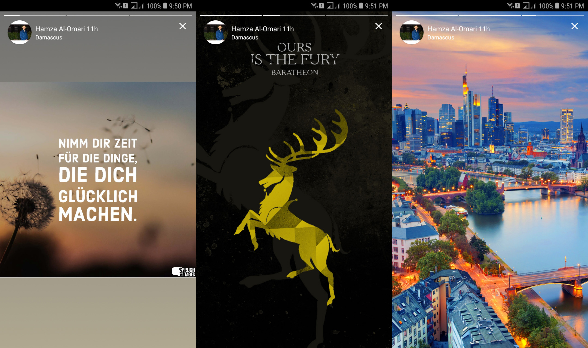
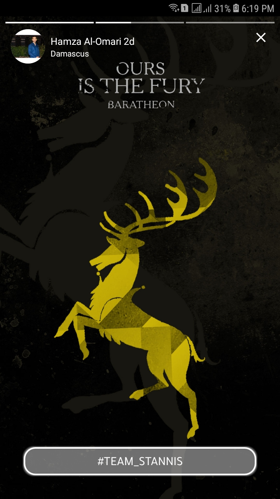

# StoryView

## Screenshots




## Release notes

* V1.0.6-alpha: RTL Support
* V1.0.2-alpha: Migrated to Java 8, Added OnStoryChangedListener, and Starting the stories from a predefined index

## Setup

#### 1. Add the gradle dependency

Add JitPack repository to your root build.gradle at the end of repositories:
```
allprojects {
		repositories {
			...
			maven { url 'https://jitpack.io' }
		}
	}
```
Add the dependency:
```
dependencies {
	        implementation 'com.github.OMARIHAMZA:StoryView:1.0.2-alpha'
	}
```
#### 2. Create the StoryView

You have two options, the first one is to use the same header (what I mean by header is the logo, title and the subtitle) for all the images in the story, or to define a custom header for each image.
Let's start first by creating the stories.

##### A. Constructing the Stories


You have to pass to the library's builder an ArrayList of 'MyStory' where MyStory represents a single story (clearly) and contains the following members:

* String url (Required/NotNull): The link of the image

* Date date (Optional/Nullable): The date when the story got posted (If you have the date as a String, use a SimpleDateFormat to parse it into a Date object)

* String description (Optional/Nullable): The description of the story which gets displayed as shown in the screenshot below:

<p align="center">

</p>

**If you don't want to display a description along with the image just pass the description as null or as an empty String and it will not be displayed.**

* Example code:

```java
MyStory currentStory = new MyStory(
                    "dummy-link",
                    simpleDateFormat.parse("20-10-2019 10:00:00"),
                    null
            );
```

**Another option is to use the second constructor which takes the url and the date only.**
* Example code:

```java
 MyStory currentStory = new MyStory(
                    "dummy-link",
                    simpleDateFormat.parse("20-10-2019 10:00:00"),
            );
```

Now, lets construct the Stories ArrayList:

Assume we have an ArrayList of 'Story' where the single 'Story' contains the fields (imageUrl & date):

```java

ArrayList<Story> data = ....;
...
ArrayList<MyStory> myStories = new ArrayList<>();

for(Story story: data){
	myStories.add(new MyStory(
                    story.getImageUrl(),
                    story.getDate()
            ));
}

```

Simple! Right?

#### B. Construction the Header(s)

##### B.1 Option one (The same header for all the images)

```java
new StoryView.Builder(getSupportFragmentManager())
                .setStoriesList(myStories) // Required
                .setStoryDuration(5000) // Default is 2000 Millis (2 Seconds)
                .setTitleText("Hamza Al-Omari") // Default is Hidden
                .setSubtitleText("Damascus") // Default is Hidden
                .setTitleLogoUrl("some-link") // Default is Hidden
                .setStoryClickListeners(new StoryClickListeners() {
                    @Override
                    public void onDescriptionClickListener(int position) {
		    	//your action
                    }

                    @Override
                    public void onTitleIconClickListener(int position) {
                        //your action
		    }
                }) // Optional Listeners
                .build() // Must be called before calling show method
                .show();

```

##### B.2 Option two (Custom header for each image)

This process is similar to the process of constructing the stories list, instead we have to create an ArrayList of 'StoryViewHeaderInfo' which contains the following fields:

* String title

* String subtitle

* String titleIconUrl

Let's construct the ArrayList<StoryViewHeadeInfo>:
	
Assume the same previous example (the ArrayList of Story) but each story in this list has a different person who posted it. 
Now the story contains these additional fields (username: String, userLocation: String, userImageUrl: String)
	
```java

ArrayList<StoryViewHeaderInfo> headerInfoArrayList = new ArrayList<>();

for (Story story : data) {
            headerInfoArrayList.add(new StoryViewHeaderInfo(
                    story.getUsername(),
                    story.getUserLocation(),
                    story.getUserImageUrl()
            ));
        }

```

##### B.3 Finally, pass the ArrayList<StoryViewHeaderInfo> to the Builder:
	
```java
new StoryView.Builder(getSupportFragmentManager())
                .setStoriesList(myStories) // MyStory's ArrayList
                .setStoryDuration(5000) // Optional, default is 2000 Millis
                .setHeadingInfoList(headerInfoArrayList) // StoryViewHeaderInfo's ArrayList
                .setStoryClickListeners(new StoryClickListeners() {
                    @Override
                    public void onDescriptionClickListener(int position) {
                        // your action
                    }

                    @Override
                    public void onTitleIconClickListener(int position) {
                    	// your action
		    }
                }) // Optional Listeners
                .build() // Must be called before show method
                .show();
		
```
	
And that's it!!

 
 ## Credit 
 
 [shts/StoriesProgressView](https://github.com/shts/StoriesProgressView): This Library was used to display the progress of the stories
 

## Developed By
#### Mhd Hamza Al Omari
* [LinkedIn](https://www.linkedin.com/in/omarihamza/)
* omarihamza@outlook.com

Please feel free to suggest any new features to be added to the Library.


## License
```
MIT License

Copyright (c) 2019 MHD HAMZA AL OMARI

Permission is hereby granted, free of charge, to any person obtaining a copy
of this software and associated documentation files (the "Software"), to deal
in the Software without restriction, including without limitation the rights
to use, copy, modify, merge, publish, distribute, sublicense, and/or sell
copies of the Software, and to permit persons to whom the Software is
furnished to do so, subject to the following conditions:

The above copyright notice and this permission notice shall be included in all
copies or substantial portions of the Software.

THE SOFTWARE IS PROVIDED "AS IS", WITHOUT WARRANTY OF ANY KIND, EXPRESS OR
IMPLIED, INCLUDING BUT NOT LIMITED TO THE WARRANTIES OF MERCHANTABILITY,
FITNESS FOR A PARTICULAR PURPOSE AND NONINFRINGEMENT. IN NO EVENT SHALL THE
AUTHORS OR COPYRIGHT HOLDERS BE LIABLE FOR ANY CLAIM, DAMAGES OR OTHER
LIABILITY, WHETHER IN AN ACTION OF CONTRACT, TORT OR OTHERWISE, ARISING FROM,
OUT OF OR IN CONNECTION WITH THE SOFTWARE OR THE USE OR OTHER DEALINGS IN THE
SOFTWARE.
```
